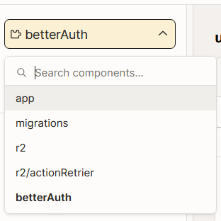
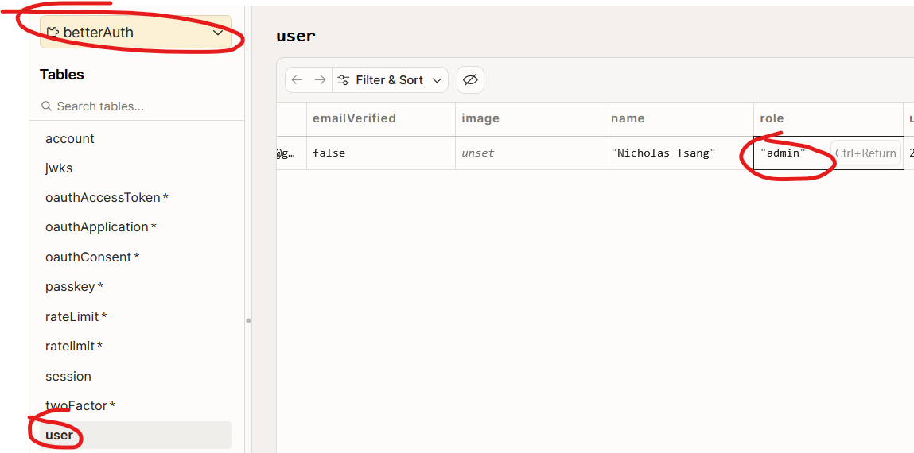

# Club Freedom Testimonial Platform

A modern testimonial collection platform built for Club Freedom, allowing users to share their experiences through text, audio, or video recordings.

## Tech Stack

- **Frontend Framework**: [React 19](https://react.dev/) with [Vite](https://vite.dev/)
- **Routing**: [TanStack Router](https://tanstack.com/router)
- **Backend**: [Convex](https://www.convex.dev/) - Real-time database and backend
- **Storage**: [Cloudflare R2](https://www.cloudflare.com/developer-platform/r2/) - Media file storage
- **UI Components**: [shadcn/ui](https://ui.shadcn.com/) with [Tailwind CSS](https://tailwindcss.com/)
- **AI**: Google Gemini - Text summarization and transcription
- **Deployment**: Cloudflare Pages (via Wrangler)

## Features

- 📝 Text-based testimonials
- 🎤 Audio recording with browser media recorder
- 🎥 Video recording with mobile and desktop support
- 🔍 Full-text search across testimonials
- 📱 Responsive design with mobile-first approach
- 🤖 AI-powered summarization using Google Gemini

## Getting Started

### Prerequisites

- Node.js 20+ and pnpm
- Convex account for backend
- Cloudflare account for R2 storage
- Google Gemini API key for AI features

### Installation

1. Clone the repository:

```bash
git clone https://github.com/hack-van/for-club-freedom-2025.git
cd for-club-freedom-2025
```

2. Install dependencies:

```bash
pnpm install
```

3. Set up environment variables (see Environment Variables section below)

4. Set up local domains and HTTPS (see Local Domains and HTTPS Setup section below)

5. Run the development server:

```bash
pnpm dev
```

6. In a separate terminal, start the Convex development server:

```bash
pnpm convex dev
```

Open [https://localhost:3000](https://localhost:3000) with your browser to see the result.

### Setting up Better Auth with Convex in your environment

1. Run pnpm install
2. Create the BETTER_AUTH_SECRET environment variable in your convex environment with the following command:
   `npx convex env set BETTER_AUTH_SECRET=$(openssl rand -base64 32)`
3. Add your site url to your convex environment variables
   `npx convex env set SITE_URL http://localhost:3000`
   In prod, use the prod site url
4. Ensure you have VITE_CONVEX_SITE_URL and SITE_URL set in your .env file.

For more details, visit this [guide](https://convex-better-auth.netlify.app/framework-guides/next)

Whenever you want to make changes to the betterAuth schemas and components, run the following command

```
cd convex/betterAuth
npx @better-auth/cli generate -y --output generatedSchema.ts
```

Note: the betterAuth tables can be accessed under the betterAuth component in the convex dash board.



### Setting up Resend

We are using [Resend](https://resend.com) as our email provider. You have to:

1. Register a resend account
2. Get an API key
3. Verify your domain.
4. Ensure the RESEND_API_KEY environment variable is set in your convex environment with the API key value.
   For more information, follow the instructions [here](https://www.convex.dev/components/resend) to set up resend in your convex environment
   We will need an official verified domain if we want our emails to not go to the spam folder.

### Creating Users

To access the admin create user page without being an admin, comment out the if condition in app\admin\createuser\page.tsx.

You must manually set the user's role in the betterAuth.users table.



### Set up R2 for Convex

To set up R2 for Convex, follow the instructions in the _Cloudflare Account_ section in the [Convex R2 documentation](https://www.convex.dev/components/cloudflare-r2#cloudflare-account).

## Environment Variables

There are two sets of environment variables: one for the Convex backend and one for the local TanStack development

- Convex backend: example of variables can be found in `convex/.env.example` file.
  You can set them in your Convex environment using the Convex CLI:

  ```bash
  npx convex env set VARIABLE_NAME=value
  ```

- Local TanStack development: example of variables can be found in `.env.example` file.
  You can copy it to `.env` by the following command:

  ```bash
  cp .env.example .env
  ```

  Then fill in the required values.

## Local Domains and HTTPS Setup

### Local domain setup

Add the following line to your `/etc/hosts` file (in Linux/MacOS) or `C:\Windows\System32\drivers\etc\hosts` file (in Windows):

```
127.0.0.1 club-freedom.local
```

Then flush your DNS cache:

```bash
# MacOS
sudo dscacheutil -flushcache; sudo killall -HUP mDNSResponder

# Windows
ipconfig /flushdns
```

### SSL certificate generation

Make sure you have [mkcert](https://github.com/FiloSottile/mkcert) installed for generating local SSL certificates. Then run the following commands:

```bash
mkdir -p ./certificates
mkcert -cert-file ./certificates/dev.pem -key-file ./certificates/dev-key.pem localhost 127.0.0.1
```

## Project Structure

```
├── app/                    # TanStack Router application
│   ├── routes/            # Route components
│   │   ├── index.tsx     # Home page (testimonial form)
│   │   ├── admin/        # Admin dashboard
│   │   └── testimonials/ # Testimonial detail pages
│   └── router.tsx        # Router configuration
├── components/            # React components
│   ├── form/             # Form components
│   ├── recorder/         # Audio/video recorder components
│   └── ui/               # shadcn/ui components
├── convex/               # Convex backend
│   ├── schema.ts         # Database schema
│   ├── testimonials.ts   # Testimonial queries/mutations
│   ├── media.ts          # Media handling
│   └── r2.ts             # R2 storage integration
├── gemini/               # Google Gemini integration
│   └── summarize_text.ts # Text summarization
└── lib/                  # Utility functions
```

## Using shadcn/ui Components

This project uses [shadcn/ui](https://ui.shadcn.com/) and [Tailwind CSS](https://tailwindcss.com/) for building UI components.

To add new components:

```bash
pnpm dlx shadcn@latest add <component-name>
```

Available components: https://ui.shadcn.com/docs/components/

## Running Convex Backend

The Convex backend provides real-time database, file storage, and serverless functions.

Start the Convex development server:

```bash
pnpm convex dev
```

Deploy to production:

```bash
pnpm convex deploy
```

## Running Isolated Scripts

To run any TypeScript file in isolation:

```bash
pnpm run_in_isolation -- path/to/your/file.ts
```

## Building for Production

Build the application:

```bash
pnpm build
```

Preview the production build:

```bash
pnpm preview
```

## Deployment

This application is configured for deployment on Cloudflare Pages using Wrangler.

1. Configure your Cloudflare account in `wrangler.jsonc`
2. Deploy using Wrangler:

```bash
pnpm wrangler pages deploy
```

## Learn More

- [TanStack Router Documentation](https://tanstack.com/router/latest)
- [Convex Documentation](https://docs.convex.dev/)
- [Vite Documentation](https://vitejs.dev/)
- [shadcn/ui Documentation](https://ui.shadcn.com/)
- [Cloudflare R2 Documentation](https://developers.cloudflare.com/r2/)

## License

This project is private and intended for Club Freedom use.

## Convex Migrations

See this [migration](https://www.convex.dev/components/migrations) page for more details.

To run a single migration, use the following command:

`pnpx convex run migrations:run '{fn: "migrations:yourMigrationName"}'`
